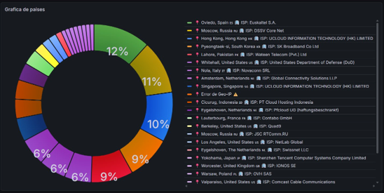
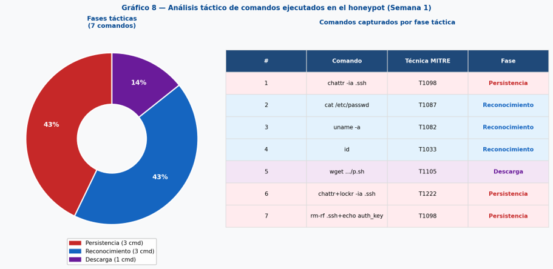
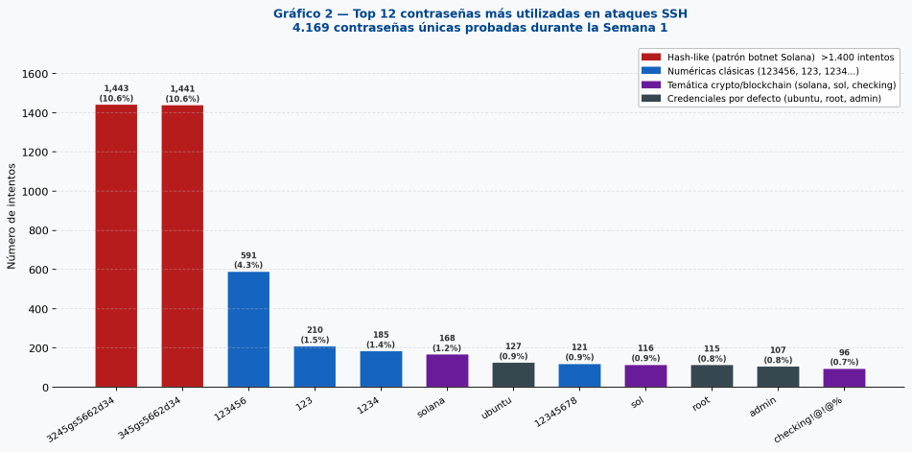
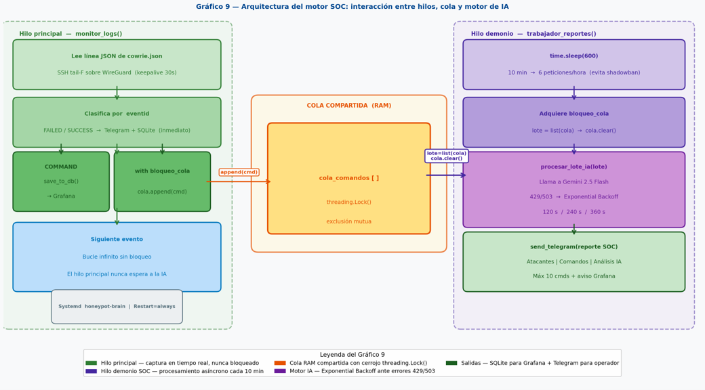

# 🛡️ Infraestructura Híbrida de Ciberinteligencia: SOC Multi-Cloud con IA

     

Proyecto de arquitectura de sistemas y ciberinteligencia diseñado para capturar, analizar y clasificar ataques SSH en tiempo real. Este sistema despliega honeypots en múltiples nubes, centraliza la recolección a través de redes privadas y utiliza inteligencia artificial (Llama 3.1) para automatizar el triaje y mapear tácticas contra el framework MITRE ATT&CK.

## 📊 Resultados Destacados (En Producción)
### Visualización y Análisis (Grafana & Power BI)

El pipeline de datos alimenta de forma asíncrona cuadros de mando operativos en Grafana (tiempo real) e informes ejecutivos en Power BI (histórico).

*(Mapa de calor global de ataques - Microsoft Power BI)*

*(Triaje en vivo de los comandos inyectados por los atacantes en el Honeypot - Grafana SOC)*

*(Detección de campaña dirigida contra nodos Solana basada en el top de contraseñas de fuerza bruta)*

Durante su operación en producción, el sistema capturó e interpretó ataques reales globales:
* **Eventos capturados:** +35.600 intentos SSH en 14 días.
* **Orígenes detectados:** IPs de 80 países distintos.
* **Inteligencia extraída:** Identificación de botnets especializadas atacando nodos de blockchain (Solana) mediante fuerza bruta y scripts automatizados de persistencia.

## 🏗️ Arquitectura del Sistema

El proyecto sigue un modelo de seguridad **Assume Breach** (asumir compromiso), separando físicamente el plano de captura (expuesto) del plano de análisis (aislado).

1. **Nodos Sensores (DigitalOcean - NYC & FRA):** Expuestos a internet. Ejecutan el honeypot **Cowrie** contenido en Docker con políticas estrictas de recursos y rotación de logs.
2. **Nodo Cerebro SOC (Microsoft Azure):** Completamente cerrado a internet (NSG estricto). Ejecuta un demonio en Python (`collector.py`) que ingesta los logs mediante streaming SSH.
3. **Red Privada (WireGuard):** Conecta todos los nodos mediante túneles cifrados (ChaCha20-Poly1305). Azure siempre inicia la conexión; los sensores no pueden comunicarse hacia el cerebro.

## 🚀 Características Técnicas Principales

* **Streaming Asíncrono sin latencia:** Uso de subprocesos (`subprocess` + `ssh tail -f`) para recolectar logs JSON de múltiples sensores simultáneamente sobre túneles WireGuard.
* **Motor SOC Multihilo (Threading):** Arquitectura de colas en RAM protegida por cerrojos lógicos (`threading.Lock()`). Un hilo captura en tiempo real, otro hilo (daemon) procesa lotes cada 10 minutos.
* **Integración de IA (Groq + Llama 3.1):** Evaluación táctica de los comandos inyectados por los atacantes y mapeo directo de IoCs a técnicas **MITRE ATT&CK** (Ej: T1110, T1021, T1098).
* **Mitigación de "Token Exhaustion":** Sanitización automatizada de *payloads* largos (scripts en Base64, claves RSA) en la capa de Python antes de consultar la API del LLM, protegiendo el contexto y la cuota.
* **Salida Dual y Observabilidad:** Alertas operativas en tiempo real vía bot de **Telegram** (Markdown) y almacenamiento estructurado en **SQLite** con modo WAL activado para consultas en vivo desde **Grafana** e histórico en **Power BI**.

## 📁 Estructura del Repositorio

* `/src`: Código fuente del motor SOC (`collector.py`) asíncrono y multisensor.
* `/infra`: Configuraciones de infraestructura como código (Docker Compose, Reglas UFW).
* `/dashboards`: Consultas SQL optimizadas utilizadas para la monitorización en Grafana.
* `/docs`: Memoria técnica completa y presentación ejecutiva del proyecto.

## 💡 Resoluciones Técnicas
Durante la puesta en producción se resolvieron diversos retos operativos de infraestructura real:
* Gestión de cuotas de API y *throttling* (migración de proveedores de IA y *Exponential Backoff*).
* Resolución de conflictos de permisos (UID 1000) entre los volúmenes del Host y contenedores Docker.
* Prevención de bloqueos de concurrencia en BBDD locales habilitando modo WAL en SQLite.
